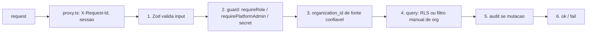

# Repository Guidelines

> Contrato portável para **qualquer** agente de código (Codex, Cursor, OpenCode, Antigravity, Copilot).
> Este arquivo é o núcleo. A **doutrina completa e não-negociável vive em [`CLAUDE.md`](CLAUDE.md)** —
> leia-o antes de tocar em código. O mapa de toda a documentação está em [`docs/index.md`](docs/index.md).
> Precedência quando dois documentos discordam: `CLAUDE.md` > `docs/specs/` > `docs/prd/` >
> `HANDOFF-*.md` > `README.md`.

## Project Overview

Sistema operacional de vendas open source com agentes de IA nativos, multi-nicho (e-commerce,
clínicas, imobiliárias, infoprodutos, serviços), WhatsApp como canal primário via WAHA, CRM
inteiro exposto por MCP. Multi-tenant com RLS desde o dia 1; LGPD nativa. Monetização =
**self-host em VPS**, não assinatura. Posicionamento: [`VISION.md`](VISION.md); estado real de
implementação: [`docs/current-state.md`](docs/current-state.md).

**Consequência que muda como você trabalha:** o produto é distribuído como código. Quem instala
numa VPS **é** o usuário. Uma mudança que funciona na máquina do dev e quebra no clone fresco é
**bug de produto**, não detalhe de ambiente. Nada que exija edição manual de arquivo na VPS entra.

Stack canônica (major; a versão exata é o `package.json`):

Next.js 16 (App Router, Turbopack) · React 19 · TypeScript 6 estrito · Tailwind 4 (config em CSS) ·
shadcn/ui (`new-york`) · Supabase (Postgres + Auth + Realtime + Storage) · Zod 4 · Vitest 4 ·
Playwright 1 · Sentry 10 · WAHA 2026.7.2 (engine NOWEB) · Upstash Redis · Vercel AI Gateway
(`@ai-sdk/anthropic|openai|google`).

> As majors acima são verificadas contra o `package.json` por
> [`tests/unit/agents-md-versoes.test.ts`](tests/unit/agents-md-versoes.test.ts) — declare **só a
> major**; afirmar minor em prosa cria débito que nenhum gate cobre e trava bump do Dependabot.
> Um teste irmão,
> [`tests/unit/documentacao-aponta-para-o-que-existe.test.ts`](tests/unit/documentacao-aponta-para-o-que-existe.test.ts),
> reprova todo path citado aqui que não exista no disco.

## Architecture & Data Flow

- **App** — Next.js 16 App Router: UI + Route Handlers no mesmo repo. Server Components por
  default; `"use client"` só com estado/evento/API de browser. Middleware de borda em `proxy.ts`
  (Next 16 renomeou `middleware.ts` → `proxy.ts`; ele injeta `X-Request-Id` e `x-pathname` e
  autentica a sessão antes da rota).
- **DB** — Supabase Postgres. RLS em toda tabela tenant-aware via helper
  (`fn_user_org_ids()`/`fn_user_role_in_org()`), a mesma função SECURITY DEFINER que o RBAC de
  aplicação usa. Schema versionado em `supabase/migrations/`; o que o self-host aplica é
  `supabase/baseline.sql`.
- **Auth** — Supabase Auth + `@supabase/ssr`, cookie `SameSite=Strict`. Sempre `getUser()` no
  server; **nunca** `getSession()`. MFA TOTP é opcional e ligado por quem administra
  (duas políticas que somam: plataforma e organização), regra pura em
  `lib/auth/politica-mfa.ts`.
- **Filas** — event sourcing leve: `event_log` + workers drenados por cron. Trigger Postgres
  **nunca** faz HTTP.
- **IA** — Vercel AI Gateway (Anthropic primário, OpenAI para embeddings), RAG por tenant,
  guardrails before-send.
- **Tempo real** — Supabase Realtime (`postgres_changes` para inbox/kanban, `broadcast` para
  sinais leves). **Storage** — bucket privado `whatsapp-media`, URL assinada.

Fluxo de uma rota autenticada de tenant:



Superfícies **não-cookie** (cada uma com guard próprio, nunca o cookie de sessão):
`app/api/v1/cron/` (Bearer `INTERNAL_CRON_SECRET`, fail-closed), `app/api/internal/`
(`x-internal-secret`), `app/api/mcp/` (Bearer `tok_...` contra `api_tokens`), `app/api/v1/webhooks/`
(HMAC + path token). Inventário e superfície de ataque: [`docs/threat-model.md`](docs/threat-model.md).

Turno do agente de IA: inbound WhatsApp → HMAC + idempotência → `event_log` → worker →
`runAgentTurn` (RAG + tools MCP) → guardrails → adapter WAHA → handoff humano se o gatilho
disparar. Entrada do turno em `lib/agent-engine/agent/inbound-turn.ts`; diagrama em
`docs/architecture/agent-turn.html`.

Idempotência de worker: `unique (organization_id, external_id)` + captura de `code === '23505'`.
Contrato completo em [`docs/specs/07-spec-events-workers.md`](docs/specs/07-spec-events-workers.md).

## Key Directories

| Path                    | O quê                                                                                                           |
| ----------------------- | --------------------------------------------------------------------------------------------------------------- |
| `app/api/`              | Route handlers REST, versionados por path. Conte quantos existem: `git ls-files 'app/api/**/route.ts' \| wc -l` |
| `app/app/`              | UI autenticada do tenant                                                                                        |
| `app/admin/`            | UI de plataforma (platform admin)                                                                               |
| `app/actions/`          | Server Actions (auth, onboarding, team, settings)                                                               |
| `lib/agent-engine/`     | Runtime do agente: turno inbound/outbound, playbooks, handoff, follow-up, memória da org                        |
| `lib/ai/`               | Modelos, custo, orçamento, RAG, dispatcher, catálogo de providers                                               |
| `lib/channels/`         | Abstração de canal (invariante de restrição de canal)                                                           |
| `lib/api/`              | `wrappers.ts` (`ok()`/`fail()`) e `errors.ts` (catálogo de códigos)                                             |
| `lib/auth/`             | `server.ts` (sessão/org), `require-role.ts` (`requireRole`), `public-paths.ts` (borda)                          |
| `lib/supabase/`         | Clients canônicos: `browser.ts`, `server.ts`, `admin.ts` (service role)                                         |
| `lib/branding/`         | Marca própria (white-label) — resolve do banco, nunca do .env                                                   |
| `workers/`              | Workers de `event_log` + crons                                                                                  |
| `components/`, `hooks/` | React compartilhado; convenções nos README de cada pasta                                                        |
| `supabase/migrations/`  | Schema versionado + `MANIFEST.md`; `supabase/baseline.sql` é o que o self-host aplica                           |
| `hostgator-setup-kit/`  | Kit de instalação/atualização da VPS (`install.sh`, `update.sh`, `diagnostico.sh`, `healthcheck.sh`)            |
| `scripts/`              | CLIs de operação e QA — ver `scripts/README.md`                                                                 |
| `tests/`                | `unit/`, `invariants/`, `e2e/`, `shell/`, `journeys/`, `fixtures/`                                              |
| `docs/`                 | Doutrina, PRDs, specs, regras de negócio, runbooks, design system — entrada em `docs/index.md`                  |
| `.agents/skills/`       | Guias do assistente embutidos (espelho em `.claude/skills/`, regerado por `pnpm skills:sync`)                   |

## Development Commands

```bash
pnpm install          # deps (frozen-lockfile no CI)
pnpm dev              # dev server
pnpm build            # next build
pnpm lint             # eslint (flat config)
pnpm typecheck        # tsc --noEmit -p tsconfig.typecheck.json
pnpm test:unit        # vitest run — EXCLUI tests/e2e, tests/invariants, tests/journeys
pnpm test:db          # invariantes de banco + gate do baseline (PRECISA de Docker)
pnpm test:e2e         # Playwright (PRECISA de app buildado + .env.e2e)
pnpm test:shell       # scripts do kit self-host (bash)
pnpm gov:verify       # typecheck + lint + lint:channels + lint:role-rank + test:unit
```

⚠️ **`pnpm gov:verify` não cobre tudo.** Ele omite `test:db`, `test:e2e` **e** `test:shell`.
Se a mudança toca schema/RLS/tabela tenant-aware, rode `pnpm test:db`. Se toca UI ou fluxo de
usuário, rode `pnpm test:e2e` com evidência visual. Se toca `Dockerfile*`, `docker-compose*` ou
`hostgator-setup-kit/`, rode `pnpm test:shell` — é o único gate que exercita o kit.

O CI tem cinco checks obrigatórios na `main`: `verify`, `build-and-size`, `invariants`, `e2e`,
`imagens-ok`. Não confie nesta lista — reconte antes de citar:

```bash
gh api repos/melgarafael/DeskcommCRM/branches/main/protection \
  --jq '.required_status_checks.contexts|join(", ")'
```

`e2e` roda três partes em paralelo; as specs de fora estão declaradas, **com motivo escrito**, em
`FORA_DO_CI` dentro de `.github/workflows/e2e.yml`. Leia em vez de supor:

```bash
git show origin/main:.github/workflows/e2e.yml | grep -A4 'FORA_DO_CI:'
```

## Embedded Assistant Guides

O repositório embute guias em `.agents/skills/` (lidos por Codex, Cursor, OpenCode, Antigravity;
o Claude Code lê o espelho em `.claude/skills/`). Carregue o guia quando o pedido casar, mesmo que
a pessoa não saiba que ele existe — `tests/unit/skills-embutidas.test.ts` exige que este arquivo
cite cada um:

| Situação                                                                            | Guia                    |
| ----------------------------------------------------------------------------------- | ----------------------- |
| Instalar, atualizar ou consertar a instalação numa VPS; domínio, Supabase, WhatsApp | `deskcomm-instalar`     |
| Configurar o CRM para um cliente ou nicho: agentes, roteadores, follow-ups, base    | `deskcomm-cliente-novo` |
| Desempenho, conversão, custo de IA, funil, relatório                                | `deskcomm-metricas`     |
| O agente responde errado, passa tudo para humano, não usa a agenda; afinar o prompt | `deskcomm-prompt`       |
| Contribuir: corrigir bug, abrir ou atualizar PR, migration, conflito com a `main`   | `deskcomm-contribuir`   |
| Escrever ou revisar código aqui                                                     | `deskcomm-doutrina`     |

O gate de arquitetura de qualquer peça que atende pessoas é a skill `sistema-vivo` (lei em
[`docs/doctrine/sistema-vivo.md`](docs/doctrine/sistema-vivo.md)).

## Code Conventions & Common Patterns

**Receita de route handler** — nesta ordem, sem atalho:

1. Zod valida **todo** input externo (body, query, path).
2. Guard canônico: `requireRole()` de `lib/auth/require-role.ts`,
   `requirePlatformAdmin`, ou secret/HMAC. Nunca reimplemente a comparação de rank na mão.
3. `organization_id` resolvido de **fonte confiável** (cookie/JWT/webhook secret/path token) —
   **nunca do body**.
4. Query: RLS pelo client de sessão, ou filtro manual de `organization_id` quando usa service role.
5. `audit()` (fire-and-forget) se houve mutação.
6. Responda com `ok()` / `fail()` de `lib/api/wrappers.ts` — nunca monte `Response` na mão.

```ts
const authz = await requireRole("manager", { requestId });
if (!authz.ok) return authz.response;
```

**Erros** — `fail(code, message, status)` com código de `lib/api/errors.ts`. Nunca `throw` cru na
borda. Cada response leva `X-Request-Id`, correlacionado com o audit log.

**Nomes e dados** — arquivos e símbolos em PT-BR são a norma (mantenha o idioma do arquivo que
editar). JSON da API em **snake_case**; dinheiro em `_cents` + `currency`; datas ISO-8601 UTC;
UUID v4. Testes ao lado do código (`lib/foo/bar.test.ts`) ou em `tests/`.

**Log** — `lib/logger.ts` (estruturado, JSON). `console.log` é proibido em código merged —
`no-console` é `warn` no ESLint e o DoD cobre o resto. Nunca logue segredo, token, CPF, telefone
ou e-mail; o `beforeSend` do Sentry higieniza, mas não é a única camada.

**Multi-tenancy** — `organization_id uuid not null references organizations(id) on delete cascade`
em toda tabela tenant-aware. `lib/supabase/admin.ts` **bypassa RLS**: toda query com service role
filtra `organization_id` manualmente. Sem gate automático para isso — a responsabilidade é sua.

**Migrations** — mudança de schema sai **sempre** como tripla: migration versionada em
`supabase/migrations/`, apêndice idempotente em `supabase/baseline.sql` e linha em
`supabase/migrations/MANIFEST.md`. Nunca edite migration já aplicada; corrija com uma nova.
Função nova em `public` precisa de `revoke execute ... from public, anon` **e** `grant` — são
duas origens de `EXECUTE`.

**Marca própria (white-label)** — o produto é revendido e o nome não é seu. **Nunca** escreva
"Deskcomm"/"DeskcommCRM" em código que alcança o usuário: `tests/unit/branding.test.ts` varre
`app|components|lib|workers|hooks` e reprova (a allowlist só encolhe). A marca resolve do banco
(`platform_branding`, `organizations.settings.branding`); `APP_NAME`/`APP_LOGO_URL`/`APP_ACCENT_HEX`
no `.env` são semente e piso de rollback. Fora do DOM (e-mail, ícone, `issuer` do MFA) use
`marcaDaSaida()` de `lib/branding/saida.ts`. O resolvedor **nunca lança** — ele roda em
`app/layout.tsx` e um throw ali é 500 em todas as telas. O PDF de LGPD não leva marca: ele nomeia
o controlador (`organizations.legal_name`) e o DPO.

**Anti-patterns proibidos** — string que deveria ser FK; duplicação sem source of truth declarado;
feature nomeando um provider de canal (gate `pnpm lint:channels`); tela nova sem porta declarada em
`lib/navigation/registry.ts` (gate `tests/unit/navegacao-completude.test.ts`); `getSession()` no
server; segredo em query string; `throw` cru na borda da API.

## Important Files

| Arquivo                                    | Por quê                                                                      |
| ------------------------------------------ | ---------------------------------------------------------------------------- |
| `proxy.ts`                                 | Middleware de borda do Next 16: auth, `X-Request-Id`, impersonation          |
| `lib/api/wrappers.ts`                      | `ok()` / `fail()` — formato de resposta e `X-Request-Id`                     |
| `lib/api/errors.ts`                        | Catálogo de códigos de erro                                                  |
| `lib/auth/require-role.ts`                 | `requireRole()` — guard canônico de RBAC                                     |
| `lib/auth/server.ts`                       | `loadAuthUser()`, `resolveActiveOrg()` — sessão e org ativa                  |
| `lib/auth/public-paths.ts`                 | Allowlist de paths sem auth de borda (só com guard próprio dentro da rota)   |
| `lib/supabase/admin.ts`                    | Service role — **bypassa RLS**                                               |
| `lib/logger.ts`, `lib/env.ts`              | Log estruturado; contrato de env vars validado por Zod                       |
| `lib/audit/index.ts`                       | `audit()` — trilha de auditoria                                              |
| `lib/database.types.ts`                    | **Gerado** do schema — não edite à mão                                       |
| `supabase/baseline.sql`                    | O que o `install.sh`/`update.sh` aplicam — toda mudança de schema entra aqui |
| `workers/agent-worker/main.ts`             | Entry point do worker de agente                                              |
| `docker-compose.prod.yml`                  | Topologia de produção (imagens publicadas)                                   |
| `docker-compose.traefik.yml`               | Labels de roteamento para VPS que já tem proxy próprio                       |
| `instrumentation.ts`, `sentry.*.config.ts` | Boot de observabilidade                                                      |

## Runtime/Tooling Preferences

- **Node ≥ 22** (`engines`, `.nvmrc` = 22; os workflows fixam `node-version: 22`). Gerenciador:
  **pnpm 9.15.9** (`packageManager`). Não use npm/yarn.
- **TypeScript estrito** via `tsconfig.typecheck.json`; `strict`, `noUncheckedIndexedAccess`,
  `isolatedModules`, alias `@/*` → raiz. `pnpm typecheck` é a régua.
- **ESLint flat config** (`eslint.config.mjs`, ESLint 9): `next/core-web-vitals`,
  `react-hooks`, `typescript-eslint`. `next lint` foi removido no Next 16 — o script chama o CLI.
- **Prettier** com `prettier-plugin-tailwindcss`; classes Tailwind em ordem canônica.
- **Tailwind 4** — configuração em CSS (`app/globals.css`), não em `tailwind.config.js`.
- **Sentry** — `beforeSend` higieniza PII; `tunnelRoute: "/monitoring"` evita ad-blocker.
- **Packaging (não-negociável; lei em [`docs/doctrine/packaging.md`](docs/doctrine/packaging.md))** —
  nenhum serviço de `docker-compose.prod.yml` constrói na máquina do cliente: todo serviço declara
  `image:` de imagem publicada, e `build:` existe só ao lado, como escape. Serviço `build:`-only é
  pulado por `docker compose pull` e **nunca é atualizado**. Publicação é ato do CI
  (`.github/workflows/publish-image.yml`), nunca da sua máquina. Instalação aponta para número de
  versão; `latest` significa topo da `main`, a última release é `stable`. Dependência upstream é
  referenciada com tag fixa, nunca republicada (WAHA é licenciado). Bump de versão não pode exigir
  edição manual de arquivo na VPS.
- **Deploy em VPS com proxy próprio** — todo `up -d` leva os **dois** arquivos de compose:
  `docker compose -f docker-compose.prod.yml -f docker-compose.traefik.yml --env-file .env up -d app`.
  Esquecer o segundo `-f` recria o contêiner sem labels: o domínio inteiro responde `404` com o
  contêiner `healthy` (o healthcheck é um probe TCP interno). Runbook:
  [`docs/runbooks/deploy.md`](docs/runbooks/deploy.md).
- **Env vars** — nova variável entra em `.env.example` **e** em `lib/env.ts`. Nunca leia nem logue
  valor de `.env*`; só `.env.example` é template. Segredo/token só em header, nunca em query string.
- **Gerados — não edite** — `lib/database.types.ts`, `graphify-out/`, `pnpm-lock.yaml`, `.next/`.

## Testing & QA

| Camada                        | Comando              | O que cobre                                                                    |
| ----------------------------- | -------------------- | ------------------------------------------------------------------------------ |
| Unit (vitest, jsdom)          | `pnpm test:unit`     | `tests/unit/**` + todo `*.test.ts(x)` ao lado do código. Timeout 15s por teste |
| Invariantes de banco (Docker) | `pnpm test:db`       | Isolamento cross-tenant/RLS, RBAC e governança contra Postgres efêmero         |
| E2E (Playwright + axe-core)   | `pnpm test:e2e`      | Jornadas reais contra app buildado e o banco do `baseline.sql`                 |
| Kit self-host (bash)          | `pnpm test:shell`    | `scripts` do kit, `install.sh`, `update.sh` — o único gate do kit              |
| Jornadas de canal             | `pnpm test:journeys` | `tests/journeys/` (config Playwright própria)                                  |

Convenções: teste ao lado do código (`lib/foo/bar.test.ts`) ou em `tests/{unit,api,invariants,e2e}`.
`tests/e2e/**` e `tests/invariants/**` são **excluídos** do vitest de propósito — não os mova para
dentro do include do unit. Fixtures em `tests/fixtures/`, helpers em `tests/helpers/`, setup global
em `tests/setup/vitest.setup.ts`. Determinismo é regra: teste que depende de ordem ou de rede
quebra a suíte inteira.

O `.env.e2e` é obrigatório e é recusado se apontar para Supabase que não seja `127.0.0.1`/
`localhost` — a proteção existe porque sem ela a suíte rodaria contra produção (`pnpm e2e:env`
gera o arquivo).

**QA visual com recursos reais (doutrina).** O produto é self-host: a experiência de quem instala
numa VPS **é** o produto. Toda feature nova, ou fix de comportamento visível, deve ser provada
pela tela como um usuário leigo faria, em ambiente fresco estilo VPS, com evidência visual.
`curl` não conta como prova de UX. Mapa de jornadas:
[`docs/testing/user-journey-map.md`](docs/testing/user-journey-map.md).

**Antes de declarar pronto**, siga a **Definition of Done de [`CLAUDE.md`](CLAUDE.md)** — não
confie na memória, conte lá:

```bash
sed -n '/^## Definition of Done/,/^Um staff engineer/p' CLAUDE.md | grep -cE '^[0-9]+\. '
```

Em resumo: typecheck/lint zerados, testes relevantes verdes, RLS testada se tocou tabela
tenant-aware, `audit()` se houve mutação, Zod em todo input externo, migration + baseline +
MANIFEST de tripla se mudou schema, prova visual se mudou UI, `pnpm test:shell` se tocou packaging,
Living System Checklist respondido (lei em `docs/doctrine/sistema-vivo.md`) e mapa vivo em
`docs/architecture/` atualizado para peça nova.

**Release** — mudança de comportamento visível a quem opera uma VPS traz o fragmento em
`.changes/` declarando o **efeito no operador** (`nada_mudou` / `capacidade_nova` / `exige_acao`),
nunca o número. O número é calculado a partir do conjunto; confira com `pnpm release:conferir` e
corte com `pnpm release:cortar`. Régua e porquê: [`docs/doctrine/versionamento.md`](docs/doctrine/versionamento.md).
Quem instalou lê o [`CHANGELOG.md`](CHANGELOG.md) antes de rodar `update.sh` — mudança que exige
ação manual aparece sob "⚠️ Requer atenção".

**Regra final — não invente.** Este repositório tem PRDs, specs, regras de negócio e doutrina
escritos. Nunca invente regra de negócio, número, SLA ou comportamento de produto. Se a regra não
está escrita, diga que não está e pergunte. Ao documentar, marque o que é **CONFIRMADO** (provado
por código) e o que é **INFERIDO**.

<!-- BEGIN:nextjs-agent-rules -->

# This is NOT the Next.js you know

This version has breaking changes — APIs, conventions, and file structure may all differ from your training data. Read the relevant guide in `node_modules/next/dist/docs/` (resolved from this file's directory; in monorepos the `next` package may not be visible from the repo root) before writing any code. Heed deprecation notices.

This block is written and re-added by `next dev` — verify at `node_modules/next/dist/server/lib/generate-agent-files.js`. Removing it from a diff only re-creates the uncommitted change; committing it with your work keeps the tree clean.

<!-- END:nextjs-agent-rules -->
